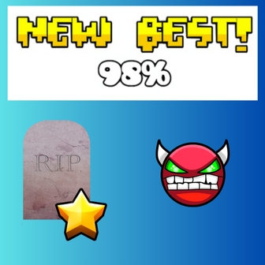

# Tombstone

**The most cinematic death animation mod for Geometry Dash!**



## 🎬 Featured Animations

###  **Explosion** *(5 seconds)*

###  **Ascension** *(5 seconds)*

###  **Slaughterhouse** *(3 seconds)*

## ⚙️ Features

- **🏆 New Best Only**: Animations trigger exclusively on new achievements
- **🎛️ Customizable**: Choose your preferred animation style
- **⏱️ Adjustable Delay**: Configure Respawn Delay (1-10 seconds)
- **🔧 Performance Optimized**: Efficient Cocos2D implementation
- **🎮 Player Restoration**: Seamless respawn with proper state management

## 🛠️ Creating Custom Animations

**Want to add your own epic death sequence?** The mod is designed for easy expansion!

### 📝 Quick Start Guide

1. **Fork this repository**
2. **Create your animation function** in `DeathAnimations.cpp`:
```cpp
void DeathAnimations::createYourNameAnimation(PlayLayer* playLayer, CCPoint playerPos) {
    // Your epic animation code here
    log::info("🎭 YOUR ANIMATION - Description");
    
    // Use Cocos2D actions like:
    // CCSequence::create(), CCSpawn::create(), CCMoveTo::create()
    // CCScaleTo::create(), CCRotateBy::create(), CCTintTo::create()
    
    // Always end with CCRemoveSelf::create() for cleanup
}
```

3. **Add to header file** (`DeathAnimations.hpp`):
```cpp
static void createYourNameAnimation(PlayLayer* playLayer, CCPoint playerPos);
```

4. **Update mod settings** (`mod.json`):
```json
"one-of": ["explosion", "ascension", "slaughterhouse", "none", "yourname"]
```

5. **Add to selector** in `createSelectedAnimation()`:
```cpp
else if (animationType == "yourname") {
    createYourNameAnimation(playLayer, playerPos);
}
```

## 🤝 Contributing

**Send me your epic animations!** 

1. **Fork this repo**
2. **Create your animation** following the guide above
3. **Test thoroughly** in Geometry Dash
4. **Submit a Pull Request** with:
   - Clear animation description
   - Duration and style notes
   - Any special effects used

**I'll review and merge the best submissions!** 🔥

